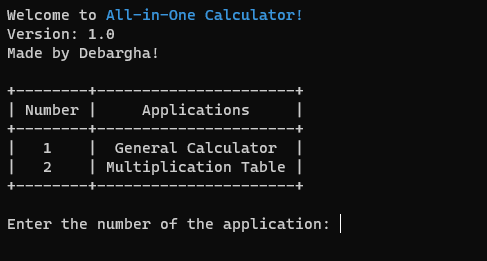

## pls dont ask me what is this sorry to github for making a repo for this thing but i will keep it public as this is my first public repo and first ever code while learning python
# All-In-One Calculator
This is a very newbie code and you may lose some of your brain cells. Btw this is incomplete.

## Features? I guess I can call them features:
- General Calculator
- Area Calculator
- Multiplication Table

## Preview:

